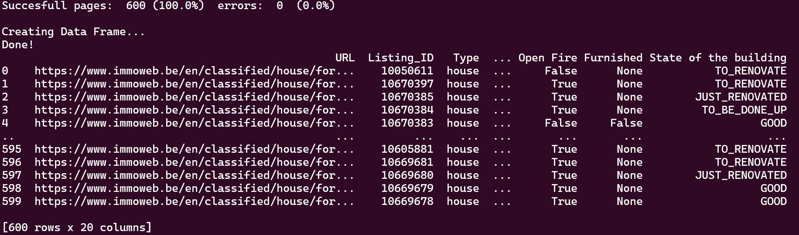

# Collecting Data

## Description
This project aims to collect data for the real estate company "ImmoEliza" in order to create a Machine Learning model for price predictions on real estate sales in Belgium. The goal is to build a dataset with information about at least 10,000 properties from all over Belgium. The dataset will be used as a training set for the prediction model.

## Installation

To use the code, you need to have the requirements above.
You can install them manually using `pip install <library name>` or just running `pip install -r requirements.txt`.

## Usage
1. Clone the repository to your local machine.
2. Install the required dependencies mentioned in the installation section.
3. Run the `main.py` file.
4. The program will fetch data from: https://www.immoweb.be/en.
5. The extracted data will be stored in a CSV file named `final-csv.csv`.

## Contributors
. Henrique Rauen
. Muhammad Firdausyi
. Fatemeh Loni

## Timeline
The project took approximately 4 days to complete.

## Personal Situation
This project was completed as part of the AI Bootcamp at BeCode.org.
